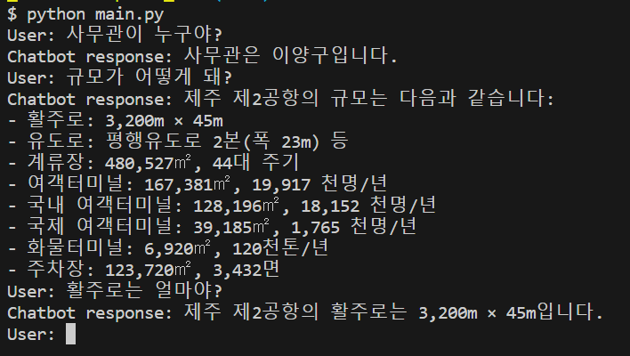

# openAI_RAG
Only use openai api to make RAG

- Chroma DB, Open AI만을 활용한 기본적인 RAG 프로젝트입니다.
- sample 문서를 입력하여, 필요한 RAG 를 테스트해보세요

## 실행결과


## Installation

1. 소스코드 내려받기
```
git clone https://github.com/Seunghyun0606/openAI_RAG
```

2. 필요한 라이브러리 설치
```
pip instarll -r requirements.txt
```
3. Open AI API key 발급받아서 ```.env```  에 넣기

4. Docker Chroma DB 실행
```
1. docker pull chromadb/chroma
2. docker run --name "name_wanted" -d -p 8000:8000 chromadb/chroma
```

## Usage
```
python main.py
```


